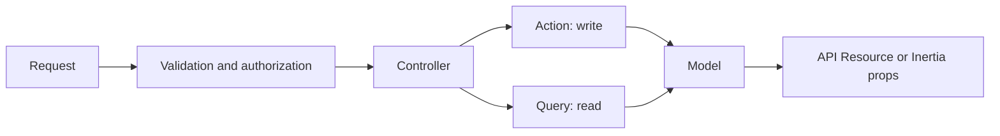

# Architecture

## Request flow

Actions implement `App\Contracts\ActionInterface`. Queries implement
`App\Contracts\QueryInterface`. Put input validation in Form Requests and
access decisions in policies. Keep controllers small.

## Platform ownership

Authentication, profiles, access control, menus, settings, audit logs, files,
backups, and database notifications belong to the platform. Application features
extend the platform through their own routes, policies, Actions, Queries, pages,
and tests.

`AppServiceProvider` registers activity observers. `AuthServiceProvider` registers
platform policies and the administrator gate. Seeders install platform permissions
and menus. Only local and testing environments create a demo administrator.

## Frontend

Inertia pages live in `resources/js/pages`. Shared components and ShadCN primitives
live in `resources/js/components`. PHP enum types are generated with
`php artisan typescript:transform`.

## API

`App\Http\Responses\ApiResponse` defines standard envelopes. Sanctum authenticates
API clients. OpenAPI is generated by Scramble from the routes and controller code.
